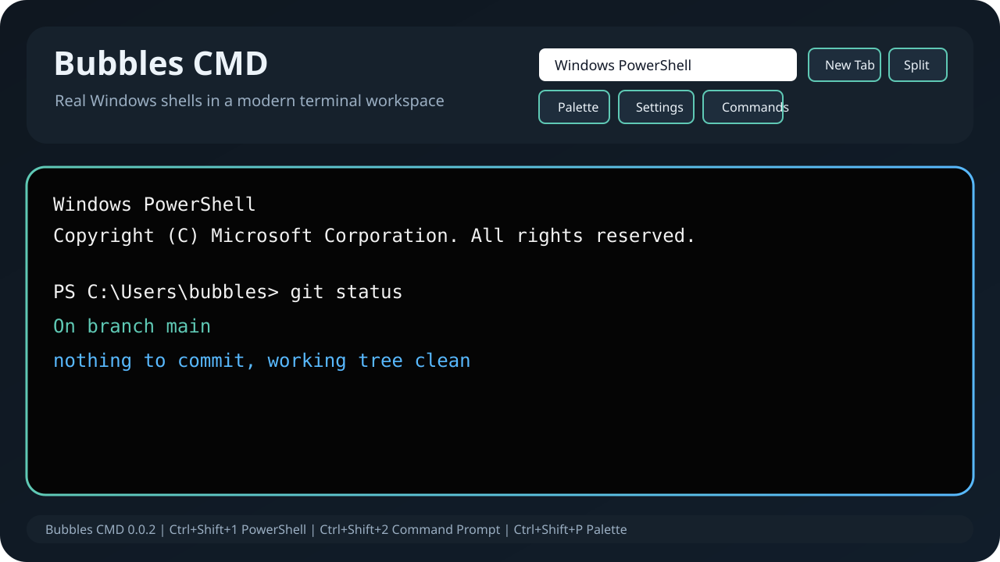

# Bubbles CMD

Version: `0.0.2`

Author: `BubblesTheDev`

Bubbles CMD is a native Windows terminal application that launches real installed Windows shells inside a modern WPF interface. It is not a command emulator and it does not replace `cmd.exe`, `powershell.exe`, or `pwsh.exe`.



## Features

- Windows Terminal-backed terminal surface through `EasyWindowsTerminalControl`.
- Real shell profiles for Windows PowerShell, Command Prompt, Azure Cloud Shell when Azure CLI is installed, Visual Studio developer shells, Git Bash, PowerShell 7, WSL, and custom profiles.
- Windows Terminal-style profile picker with `Ctrl+Shift+1` through `Ctrl+Shift+9` profile shortcuts.
- Tabs, split panes, resizable panes, pane swapping, move-pane-to-tab, duplicate panes, pane zoom, reopen closed tabs, rename, pin, restart, terminate, copy, paste, search, snippets, command browser, and command palette.
- Settings UI with local JSON settings, custom profiles, administrator-requested custom profiles, snippets, workspace restore, theme presets, appearance settings, import, export, and reset.
- Paste safety review for multiline content, risky command patterns, and hidden control characters.
- Local-only diagnostics with no command text, terminal output, or clipboard content recorded.
- Framework-dependent ZIP packaging and installer scaffolding.

## Quick Start

```powershell
dotnet restore .\BubblesCmd.sln
dotnet run --project .\src\BubblesCmd.App\BubblesCmd.App.csproj
```

## Test

```powershell
dotnet run --project .\tests\BubblesCmd.Tests\BubblesCmd.Tests.csproj
```

## Package

```powershell
powershell -NoProfile -ExecutionPolicy Bypass -File .\scripts\package.ps1
```

The packaged app is created at:

```text
artifacts\packages\bubbles-cmd-0.0.2-win-x64.zip
```

## Terminal Smoke Checklist

```powershell
powershell -NoProfile -ExecutionPolicy Bypass -File .\scripts\terminal-smoke.ps1
```

## Installer

Installer scaffolding is available under `installer\`. See [installer/README.md](installer/README.md).

Build the MSI locally with:

```powershell
powershell -NoProfile -ExecutionPolicy Bypass -File .\scripts\build-msi.ps1
```

The MSI is created at:

```text
artifacts\installer\bubbles-cmd-0.0.2-win-x64.msi
```

## Documentation

- [Detailed README](docs/README.md)
- [Changelog](CHANGELOG.md)
- [Release Notes](docs/RELEASE_NOTES.md)
- [Privacy Policy](PRIVACY.md)
- [Security Policy](SECURITY.md)
- [Manual Test Plan](docs/manual-test-plan.md)
- [Installer Notes](installer/README.md)

## Privacy

Bubbles CMD has no telemetry, analytics, command uploads, clipboard uploads, terminal-output uploads, advertising, or automatic crash uploads.

## License

MIT. See [LICENSE](LICENSE).
